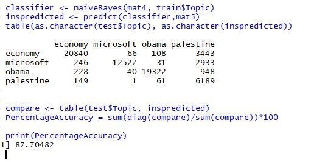
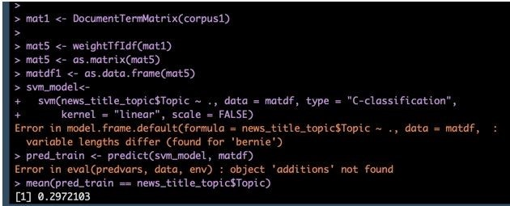
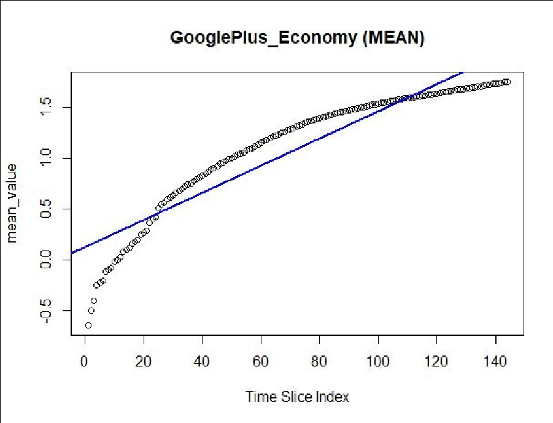
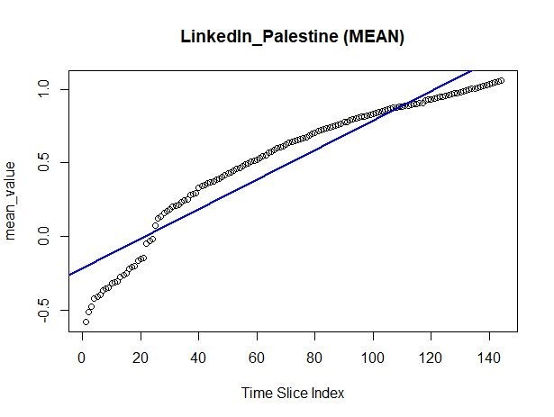
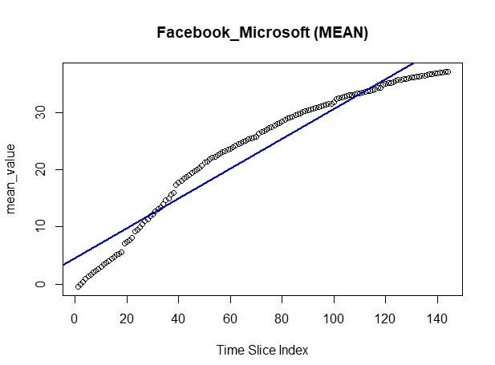
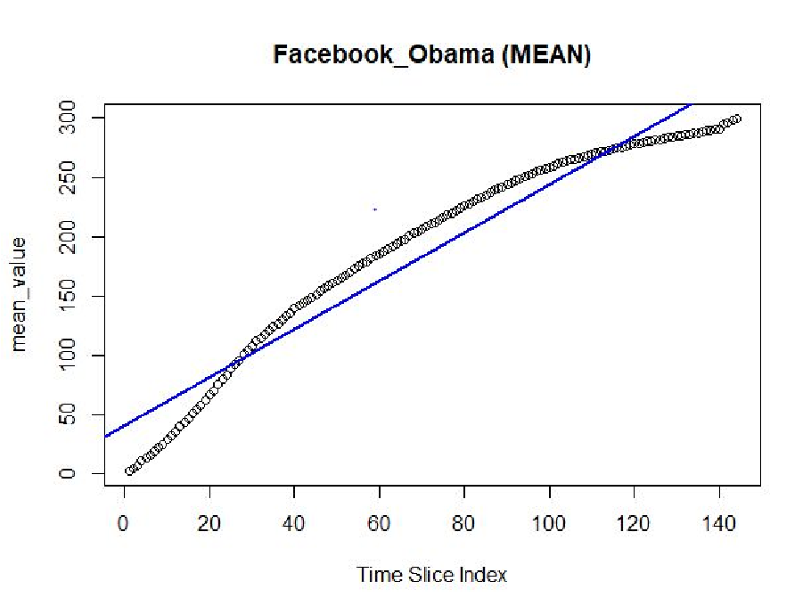

## Data-Mining on News Popularity across Social Media ##
The dataset contains news items and their respective social feedback on multiple platforms like Facebook, Google+ and LinkedIn. The collected data relates to a period of 8 months, between November 2015 and July 2016, accounting for about 100,000 news items on four different topics:
* Economy.
* Microsoft.
* Obama.
* Palestine.

### Naive Bayes Classification ###
The technique of classification is used to segregate the news articles into the four groups. Supervised learning is performed on the given data using the Topic attribute which provides the group identity of a news article. Classification is an appropriate choice for this dataset as the class assignments are known and the given data can be trained such that the classes of news articles can be correctly predicted and the articles can be assigned to their target classes or groups on the basis of their titles.

### Support Vector Machine ###
The objective of using a Support Vector Machine is to find a hyperplane in an N-dimensional space that distinctly classifies the data points. For multiclass classification using SVM, the most common technique called as One versus All has been used.

A Naïve Bayes Classifier and SVM model were created using R to classify the headlines into multiple classes.
A statistical analysis is carried out through hypothesis testing, p-tests, t-tests and ANOVA tests on the dataset.
Performed Bivariate Linear Regression to predict the popularity of news based on 144 time slices.

### Linear Regression ###
Regression is used for using predictive analysis of news headlines based on the type of the headline and the date when the news article was published. Regression would be most favored as ,in statistical modeling, regression analysis is a set of statistical processes for estimating the relationships among variables. More specifically, regression analysis helps one understand how the typical value of the dependent variable changes when any one of the independent variables is varied, while the other independent variables are held fixed.

